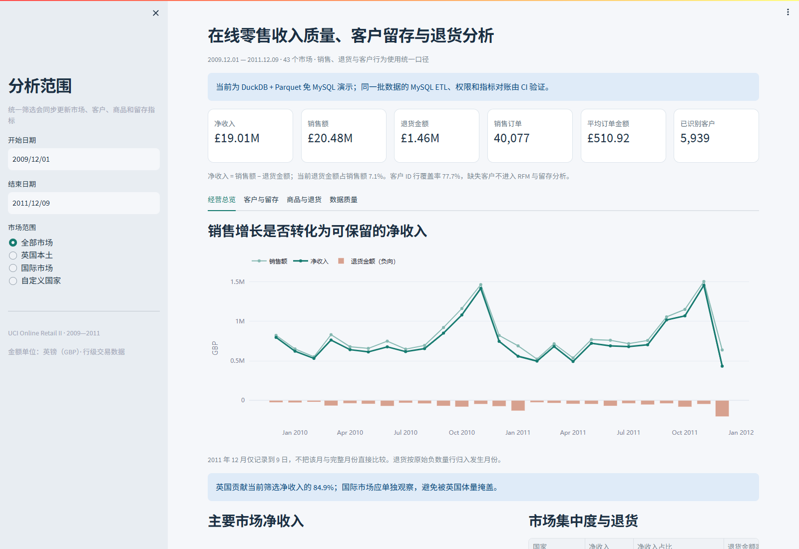

# Online Retail II 收入质量、客户留存与退货分析

[](https://github.com/wowo-blip/retail-store-analytics/actions/workflows/ci.yml)

围绕“销售额有多少最终转化为净收入、收入集中在哪里、哪些客户与商品值得优先调查”构建端到端零售分析系统：

**UCI 官方下载与哈希校验 → 数据质量画像 → Parquet → MySQL → SQL 指标 → RFM / Cohort / Wilson 区间 → Streamlit 看板 → CI 浏览器验证**

数据包含 1,067,371 条 2009—2011 年英国在线零售行级记录。项目保留取消单、负数量、重复、缺失客户 ID 和非正价格等原始事实，通过公开规则区分销售、退货和经营指标排除行。



## 核心发现

- 销售额 £20.48M，退货金额 £1.46M，净收入 £19.01M；退货金额相当于销售额的 7.14%。
- 英国贡献 84.91% 的净收入，国际市场必须单独观察，避免被英国体量掩盖。
- 在净收入为正的已识别客户中，72.71% 至少有两个销售发票；收入前 10% 客户贡献 63.02%。
- 最早 cohort 的次月活跃率为 35.29%；“活跃”指当月再次购买，不要求逐月连续。
- 商品与市场退货比较同时展示分母，并对市场退货相关发票占比计算 95% Wilson 区间，避免把小样本极端比例当作稳定风险。

这些结果是描述性证据，不包装成因果结论或“提升销售额”的实际效果。完整口径见 [经营分析报告](reports/经营分析报告.md)。

## 工程实现

- 固定 UCI ZIP 与 Excel SHA-256；下载文件不匹配即停止流程。
- 106 万行 Excel 分表读取、字段标准化、异常画像和 Zstandard Parquet 输出。
- MySQL 8.4 事务批量入库；失败时全量回滚，导入后对账行数、销售行和退货行。
- ETL 与看板账户分离；看板账户仅有 `SELECT` 权限。
- MySQL 是工程主链路；DuckDB 直接查询 12.8 MB Parquet 作为免 MySQL 在线演示后端。
- 自动测试逐表核对 MySQL 与 DuckDB 的 KPI、月份、国家、商品、客户和 cohort 结果。
- GitHub Actions 在 Linux + MySQL 8.4 上执行下载、ETL、报告、测试和真实浏览器冒烟检查。
- Docker Compose 依次启动 MySQL、一次性 ETL 和只读 Streamlit 看板。

技术栈：Python 3.11、Pandas、PyArrow、DuckDB、MySQL 8.4、SQLAlchemy、PyMySQL、Plotly、Streamlit、pytest、Playwright、Docker。

## 快速查看

无需 MySQL，直接使用仓库内处理后 Parquet：

```powershell
python -m venv .venv
.\.venv\Scripts\python.exe -m pip install -r requirements-lock.txt
$env:RETAIL_DATA_MODE='demo'
.\.venv\Scripts\python.exe -m streamlit run app.py
```

Linux / macOS 将最后两行改为：

```bash
RETAIL_DATA_MODE=demo .venv/bin/python -m streamlit run app.py
```

## 完整 MySQL 流程

跨平台推荐使用 Docker Desktop：

```bash
docker compose up --build
```

打开 http://127.0.0.1:8502 。Compose 会下载并校验 UCI 数据、启动 MySQL 8.4、以 ETL 账户导入，再以只读账户启动看板。

停止容器使用 `docker compose down`。如明确需要删除本地数据库卷，再使用 `docker compose down -v`。

Windows 原生环境需安装 Python 3.11 和 MySQL 8.4，并将 `mysqld.exe` 加入 PATH：

```powershell
python -m venv .venv
.\.venv\Scripts\python.exe -m pip install -r requirements-lock.txt
.\.venv\Scripts\python.exe scripts\setup_local.py
.\.venv\Scripts\python.exe scripts\start_local.py
```

完整重算：

```powershell
.\.venv\Scripts\python.exe scripts\download_data.py
.\.venv\Scripts\python.exe -m retail.etl
.\.venv\Scripts\python.exe -m retail.report
.\.venv\Scripts\python.exe -m pytest -q
```

## 数据与许可

数据由 UCI Machine Learning Repository 发布，创建者为 Daqing Chen，许可证为 CC BY 4.0，DOI 为 [10.24432/C5CG6D](https://doi.org/10.24432/C5CG6D)。原始 Excel 不提交到仓库；处理后 Parquet 继续遵循 CC BY 4.0。

项目代码和文档采用 MIT 许可证。完整署名、哈希、字段字典、质量画像和分类规则见 [数据来源与处理口径](data/SOURCE.md)。

## 目录

```text
app.py                              中文交互看板
retail/etl.py                       Excel 校验、分类、Parquet 与 MySQL 事务导入
retail/queries.py                   MySQL 参数绑定与指标查询
retail/demo.py                      DuckDB / Parquet 演示查询
retail/statistics.py                Wilson 区间、RFM、cohort 与集中度
retail/report.py                    可引用报告和结果表生成
sql/schema.sql                      事实表、约束和索引
sql/metrics.sql                     KPI、市场、商品、客户和 cohort SQL
data/processed/retail_lines.parquet 处理后演示快照
data/SOURCE.md                      来源、许可、哈希和数据口径
tests/test_pipeline.py              数据、SQL、统计和双后端对账测试
tests/dashboard-smoke.cjs           真实浏览器冒烟测试
```

## 分析边界

- 数据来自一家匿名英国非门店零售商，时间为 2009—2011 年，不代表当前行业水平。
- 约 22.3% 的有效商业行缺少客户 ID；RFM、复购和 cohort 仅代表可识别客户。
- 取消发票通常对应历史销售，但没有稳定的原销售—退货配对键，因此不宣称严格的订单退货概率。
- 数据没有营销触点、获客成本、退货原因和履约信息，不进行 ROI 或因果归因。
- RFM 五分位和 Wilson 区间用于排序调查与表达不确定性，不替代业务实验。

## 简历表述

> **在线零售收入质量与客户留存分析平台｜Python、MySQL、DuckDB、Streamlit**
> 构建 106 万条 UCI 零售交易的下载校验、异常分层、Parquet/MySQL 双存储、SQL 指标及交互看板；区分 £20.48M 销售额、£1.46M 退货与 £19.01M 净收入，并通过 RFM、月度 cohort 和 95% Wilson 区间识别 84.91% 英国市场集中及前 10% 客户贡献 63.02% 的收入集中；以 20 项 pytest、跨后端对账和 Playwright 浏览器检查保障可复现性。

开发过程中使用 AI 编程助手协助检索、实现与审查；数据口径、统计假设、测试标准和最终代码由项目作者核验。设计取舍见 [项目设计](docs/项目设计.md) 与 [指标和统计方法](docs/指标与统计方法.md)。
